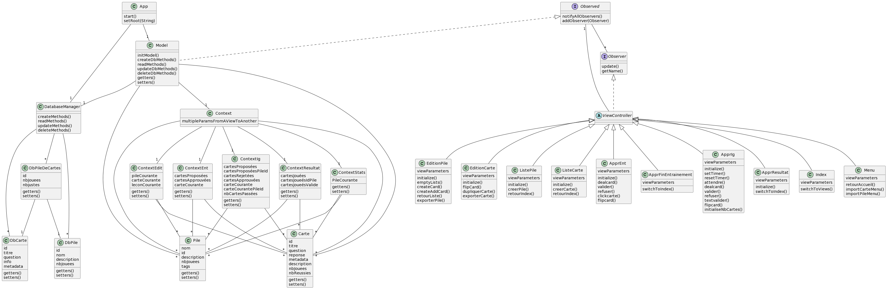
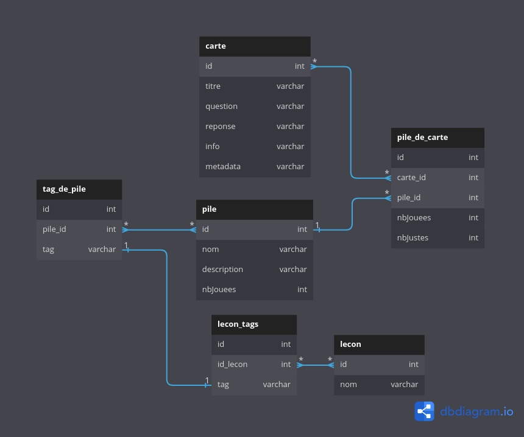
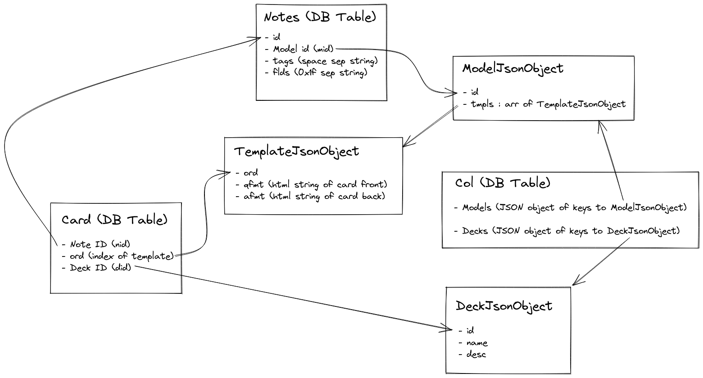
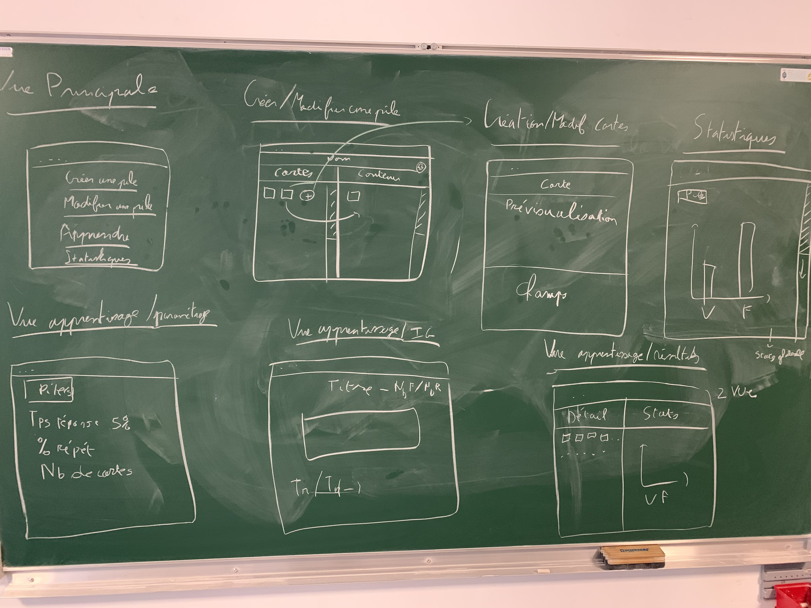
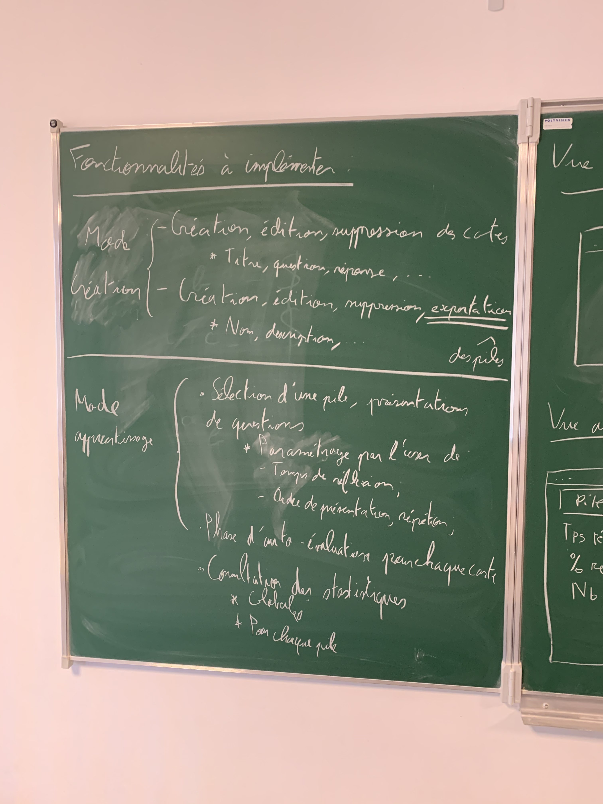

# codingweek-15

## Utilisation

Le projet se lance avec la commande `./launch.sh`.

Il est possile de produire un fichier `.jar` grâce à la commande `./assemble.sh`.

## Conception

### Dépendances

Ce projet dépend des librairies [ORMLite](https://ormlite.com), [JavaFX](https://openjfx.io/), [JUnit5](https://junit.org/junit5/) et [GSON](https://github.com/google/gson).

## Diagramme de classes

Voici le diagramme de classes de l'application : 

## Fonctionnement

### Build System

Ce projet utilise Maven en tant que build system. L'utilitaire `mvn` est donc nécessaire pour l'utilisation correcte de celui-ci.

### Packaging

Le projet peut être compilé en un seul fichier `.jar` avec les dépendances gràce à la commande `./assemble.sh`.

Il sera enregistré dans le dossier `target`.

### Base de données

Les données de l'application sont stockées dans une base de donées SQLite nommée `amplet.db` enregistrée dans le dossier temporaire de la machine de l'utilisateur (`/tmp` sous Linux, `%TMP%` sous Windows).

L'application interface avec cette base de données grâce à l'ORM (Object Relational Mapper) [ORMLite](https://ormlite.com/) et le driver [sqlite-jdbc](https://github.com/xerial/sqlite-jdbc) de Xerial.

Le schéma de la base de données est le suivant : 

### Import et export en JSON

Il est possible d'importer et d'exporter des piles et des cartes au format JSON grâce à la librairie [GSON](https://github.com/google/gson).

### Import du format `.apkg`

Nous avons commencé à implémenter cette fonctionnalité sans avoir eu le temps de l'inclure dans l'application à cause de la complexité du format `.apkg`.
Un schéma des informations utiles à notre application est disponible ici : 

## Tests

Les tests peuvent être lancés avec la commande `./test.sh`.

Ils sont implémentés grâce au framework [JUnit5](https://junit.org/junit5/) et lancés grâce au plugin [Maven Surefire](https://maven.apache.org/surefire/maven-surefire-plugin/).

Les tests couvrent les opérations sur la base de données et la sérialisation/désérialisation des cartes et piles en JSON.

## Releases

### Jour 1

Nous n'avons pas pensé à faire un jar à la fin du premier jour. Nous avons réalisé une première conception de l'application :

### Jour 2

Le fichier `.jar` de la release du jour 2 est disponible [ici](https://cdn.discordapp.com/attachments/1060246427755888742/1060246467853439108/flashcards-DAY2-jar-with-dependencies.jar) (le fichier est trop volumineux pour passer sur GitLab). Nous avons réalisé la majorité des vues (3 vues non terminés). La création de pile et l'ajout de carte est fonctionnel. Par contre il n'était pas encore possible de jouer correctement.

### Jour 3

Nous n'avons pas fait de jar ce jour la. Mais le mode entraînement et le mode compétition étaient fonctionnels (bien que quelques bugs subsistaient). Il manque encore la gestion des données après l'apprentissage. Certains designs ont été retravaillés. Les imports, exports de cartes et de piles ont été gérés au format JSON.

### Jour 4

Nous avons effectué un refactor pour réduire le couplage et correctement séparer les vues du modèle.
L'ajout d'image est maintenant possible sur les flashcards.
Nous avons rendu fonctionnelle la page de statistiques et la page de résultats après une sessions d'apprentissage. Nous avons fini de lier la page `ApprParam` et la page `ApprIg` afin que l'on puisse correctement jouer au jeu.  L'après-midi a consisté en la finalisation de projet, des tests et des corrections de bug.  

## Bilan

Nous avons réussi à implémenter la majorité des fonctionnalités que nous souhaitions intégrer à l'application.
Nous aurions aussi pu prêter plus d'attention à la conception dès le début du projet afin d'éviter une grosse étape de refactoring le dernier jour. Cela nous a fait prendre un peu de retard sur la fin du projet, retard accentué par les problèmes de PC d'un des membres du projet.
